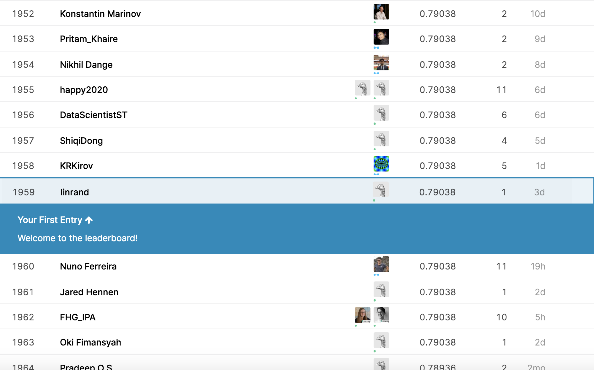

### lin ruan 1001778510
{} Download {}


### Python Tool Packages


```python
import pandas as pd
import numpy as np
from textblob import TextBlob
import nltk
nltk.download('stopwords')
nltk.download('punkt')
nltk.download('wordnet')
from nltk.corpus import stopwords
from nltk.tokenize import word_tokenize 
from nltk.stem import PorterStemmer
from textblob import Word 
from sklearn.feature_extraction.text import CountVectorizer
from sklearn.feature_extraction.text import TfidfVectorizer
from sklearn import feature_extraction, linear_model, model_selection, preprocessing
from sklearn.linear_model import LogisticRegression
from sklearn.metrics import accuracy_score
from sklearn.naive_bayes import MultinomialNB

```

```python
train = pd.read_csv("train.csv")
test = pd.read_csv("test.csv")

```

```python
train.head(10)

```

```python
test.head(10)

```
### Data Preprocessing


```python
def lable_df_func(dataset, flag):

    if flag == 0:
        lable_list = [TextBlob(i) for i in dataset['text']]
        lable_values = [[lable.sentiment.polarity] for lable in lable_list]
        lable_df = pd.DataFrame(lable_values, columns=["polarity"])
    if flag == 1:
        lable_list = [TextBlob(str(i)) for i in dataset]
        lable_values = [[lable.sentiment.polarity, str(lable)] for lable in lable_list]
        lable_df = pd.DataFrame(lable_values, columns=["polarity_lem", "lems"])
    
    return lable_df

```


```python
def set_weight(data, lable_df, flag):
    if flag == 0:
        data = pd.concat([data, lable_df], axis=1)
    else:
        data = pd.concat([data, lable_df["lems"]], axis=1)
    return data
```


```python
def preprocess(dataset):
    golden_res = []
    stop_words = set(stopwords.words('english'))
    for key in dataset["text"]:
        occupy_list = word_tokenize(key) 
        occupy_list=[word.lower() for word in occupy_list if word.isalpha()]
        lable_cata = [i for i in occupy_list if not i in stop_words] 
        lable_cata = [] 

        for key in occupy_list: 
            if key not in stop_words : 
                if  key != 'http':
                    lable_cata.append(key) 

        Stem_words = []
        ps = PorterStemmer()
        for key in lable_cata:
            rootWord = ps.stem(key)
            Stem_words.append(rootWord)
        lem = []
        for key in lable_cata:
            lable1 = Word(key).lemmatize("n")
            lable2 = Word(lable1).lemmatize("v")
            lable3 = Word(lable2).lemmatize("a")
            lem.append(Word(lable3).lemmatize())
        golden_res.append(lem)
    return golden_res

```


```python
def replace(dataset):
    dataset["lems"]= dataset["lems"].str.replace("[", "") 
    dataset["lems"]= dataset["lems"].str.replace("]", "") 
    dataset["lems"]= dataset["lems"].str.replace("\'", "") 
    dataset["lems"]= dataset["lems"].str.replace(",", " ")
    
```


```python
def run_all_func(train, test):
    # train function
    lable_df_train = lable_df_func(train, 0)
    train_ret = set_weight(train, lable_df_train, 0)
    golden_res_train = preprocess(train_ret)
    lable_df_train = lable_df_func(golden_res_train, 1)
    train_ret = set_weight(train_ret, lable_df_train, 1)
    replace(train_ret)
    
    # test function
    golden_res_test = preprocess(test)
    lable_df_test = lable_df_func(golden_res_test, 1)
    test_ret = set_weight(test, lable_df_test, 0)
    replace(test_ret)
    
    return train_ret, test_ret

```


```python
train, test = run_all_func(train, test)

```


```python
test.head()  

```


```python
train.head()  

```


### Build model

```python
count_model = CountVectorizer()
X_train = count_model.fit_transform(train["lems"])
X_test = count_model.transform(test["lems"])

```


```python
tfidf_model = TfidfVectorizer()
X_train_tfidf = tfidf_model.fit_transform(train["lems"])
X_test_tfidf = tfidf_model.transform(test["lems"])

```

## Generate submission file

```python
def save_csv():
    sample_submission = pd.read_csv("sample_submission.csv")
    sample_submission["target"]= bayes_model.predict(X_test)
    sample_submission.to_csv("submission.csv", index=False)


```


```python
save_csv()

```


## Final Ranking

