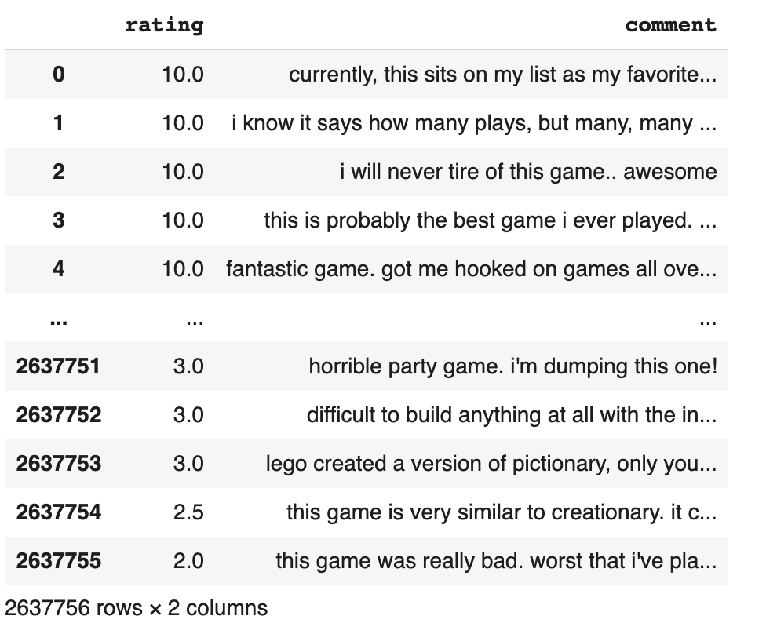
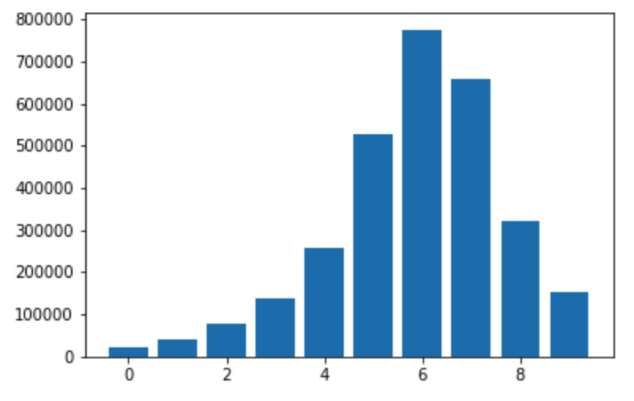
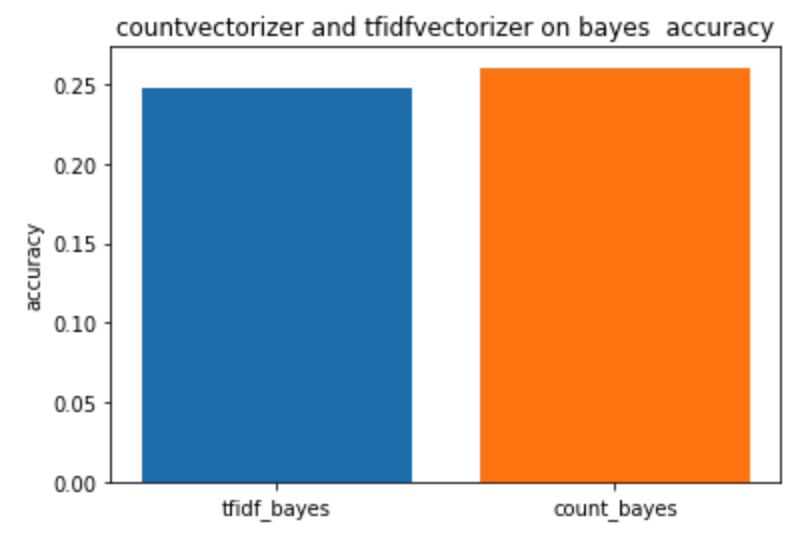
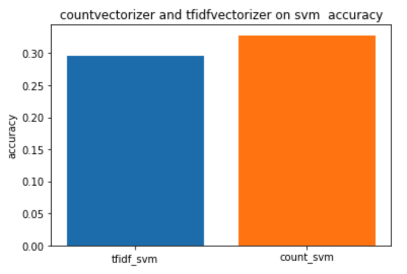
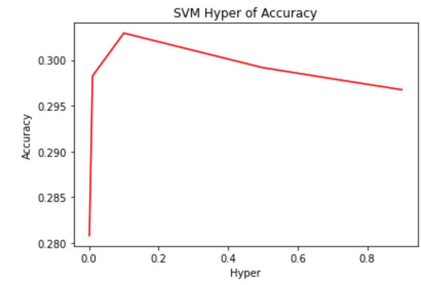

{} Download jupyter {}

{} Download PDF {}
## Predicting the Rating through Comment
### Data Mining Term Project
### Lin Ruan
### 1001778510

#### Youtube Video: https://www.youtube.com/watch?v=R5sm9YaFYlg
#### Github: https://github.com/Randcc/dm_predict_rating.git
#### kaggle: https://www.kaggle.com/linrand/board-game-rating-prediction?scriptVersionId=33922091


```python
import pandas as pd
import numpy as np
import re
import matplotlib.pyplot as plt
from sklearn.feature_extraction.text import TfidfVectorizer
from sklearn.feature_extraction.text import CountVectorizer
from sklearn.naive_bayes import MultinomialNB
from sklearn.svm import LinearSVC
from sklearn.metrics import accuracy_score
from sklearn import feature_extraction, linear_model, model_selection, preprocessing

```

### data preprocess.
#### for this part, we load our dataset, and then drop useless column, and we also drop contain miss value line, and we convert the uppercase letters to lowercase, and the below is shown the dataset we have processed, it contains the rating and comment column.

```python

def preprocess(file_path):
    
    comment_rating = pd.read_csv(file_path, encoding = "ISO-8859-1")
    comment_rating = comment_rating.drop(columns=["Unnamed: 0", 'user', 'ID', 'name'])
    comment_rating = comment_rating.dropna(axis = 0, how = 'any')    
    comment_rating = comment_rating.reset_index(drop = True)
    comment_rating["comment"] = comment_rating["comment"].apply(lambda x: x.lower())
    
    return comment_rating

comment_rating = preprocess('/content/drive/My Drive/dm_final/boardgamegeek-reviews/bgg-13m-reviews.csv')   

comment_rating


```




#### And then, we producing our rating part, let the rating number round to integer, it's benefit to the next part we predict the comment.
```python

def generation_new_set(comment_rating):
    rating_num_set = {}
    for rating in range(1, 11, 1):
        new_comment_rating = comment_rating.loc[comment_rating['rating'] >= (rating - 0.5)]
        new_comment_rating = new_comment_rating.loc[new_comment_rating['rating'] <= (rating + 0.5)]
        new_comment_rating = new_comment_rating.sample(frac = 1).reset_index(drop = True)
        rating_num_set[rating] = new_comment_rating
    return rating_num_set

rating_num_set = generation_new_set(comment_rating)

for rating in rating_num_set:
    print("rating: ", rating, "rating num:",  len(rating_num_set[rating]))
    


```

```python
rating:  1 rating num: 20960
rating:  2 rating num: 40766
rating:  3 rating num: 77967
rating:  4 rating num: 136565
rating:  5 rating num: 255791
rating:  6 rating num: 526481
rating:  7 rating num: 775531
rating:  8 rating num: 657581
rating:  9 rating num: 322400
rating:  10 rating num: 153530
```


#### it's show the bar chat about the rating and the rating number. the rating of 6, 7, 8 contains most part.

```python

rating_list = []
for rating in rating_num_set: 
    rating_list.append(len(rating_num_set[rating]))
plt.bar(range(len(rating_list)), rating_list)
plt.show()

```




#### split the data into trainset testset development set, and reset index.

```python
def split_train_dev_test(comment_rating):
   
    train_set = comment_rating[:int(0.7 * len(comment_rating))]
    test = comment_rating[int(0.7 * len(comment_rating)):]
    test_set = test[:int(0.5 * len(test))]
    dev_set = test[int(0.5 * len(test)):]
    
    dev_set = dev_set.sample(frac = 1).reset_index(drop = True)
    test_set = test_set.sample(frac = 1).reset_index(drop = True)
    
    train_set = train_set.copy()
    train_set['reating'] = [round(rating) for rating in train_set['rating']]
    test_set['reating'] = [round(rating) for rating in test_set['rating']]
    dev_set['reating'] = [round(rating) for rating in dev_set['rating']]

    return train_set, test_set, dev_set

train_set, dev_set, test_set = split_train_dev_test(comment_rating)

```

```python
print("length of train_set: ", len(train_set))
print("length of dev_set: ", len(dev_set))
print("length of test_set: ", len(test_set))

```

length of train_set:  1846429
length of dev_set:  395663
length of test_set:  395664


#### we design two vectorizer function: tfidf and count, and use this function to process the train set and development set, to get the result for next prediction, and then compared the accuracy of the two vectorizer function handal the modul efficiency.

```python
def vectorizer_tfidf(train_set, test_set, dev_set):
    tfidf_model = TfidfVectorizer()
    tfidf_model.fit(train_set['comment'])
    
    train_tfidf = tfidf_model.transform(train_set['comment'])
    test_tfidf = tfidf_model.transform(test_set['comment'])
    dev_tfidf = tfidf_model.transform(dev_set['comment'])
    
    train_tag = train_set['reating'].astype(int)
    test_tag = test_set['reating'].astype(int)
    dev_tag = dev_set['reating'].astype(int)
    
    return train_tfidf, train_tag, test_tfidf, test_tag, dev_tfidf, dev_tag

train_tfidf, train_tag, test_tfidf, test_tag, dev_tfidf, dev_tag = vectorizer_tfidf(train_set, test_set, dev_set)


```


```python
def vectorizer_count(train_set, test_set, dev_set):
    count_model = CountVectorizer()
    count_model.fit(train_set['comment'])
    
    train_count = count_model.transform(train_set['comment'])
    test_count = count_model.transform(test_set['comment'])
    dev_count = count_model.transform(dev_set['comment'])
    
    train_tag = train_set['reating'].astype(int)
    test_tag = test_set['reating'].astype(int)
    dev_tag = dev_set['reating'].astype(int)
    
    return train_count, train_tag, test_count, test_tag, dev_count, dev_tag

train_count, train_tag, test_count, test_tag, dev_count, dev_tag = vectorizer_count(train_set, test_set, dev_set)


```

## naive bayes modul.
#### use naive bayes modul to train our dataset and predict the rating, the bayes theorem p(y|x1x2x3...xn) = p(x1x2x3...xn|y)p(y) / p(x1x2x3...xn). to get the predict, we useing two method to compared the prediction, and drow the bar graph to visualization.

```python
accuracies = {}

def apply_tiidf_bayes(train_tfidf, train_tag, dev_tfidf, dev_tag):
    naive_bayes = MultinomialNB()
    naive_bayes.fit(train_tfidf, train_tag)
    dev_predict = naive_bayes.predict(dev_tfidf)
    accuracy = accuracy_score(dev_tag, dev_predict)
    accuracies['tfidf_bayes'] = accuracy
    print('tfidfvectorizer on naive bayes accuracy: ', accuracy  * 100)
    return accuracies

accuracies = apply_tiidf_bayes(train_tfidf, train_tag, dev_tfidf, dev_tag)


```
tfidfvectorizer on naive bayes accuracy:  24.813793556637844


```python
def apply_tiidf_bayes(train_count, train_tag, dev_count, dev_tag):
    naive_bayes = MultinomialNB()
    naive_bayes.fit(train_count, train_tag)
    dev_predict = naive_bayes.predict(dev_count)
    accuracy = accuracy_score(dev_tag, dev_predict)
    accuracies['count_bayes'] = accuracy
    
    print('countvectorizer on naive bayes accuracy: ', accuracy * 100)
    return accuracies, naive_bayes

accuracies, naive_bayes = apply_tiidf_bayes(train_count, train_tag, dev_tfidf, dev_tag)


```

countvectorizer on naive bayes accuracy:  26.034023904181087


```python
figure = plt.figure(figsize=(6, 4)).add_subplot()        
figure.set_title('countvectorizer and tfidfvectorizer on bayes  accuracy')
figure.set_xticklabels(['tfidf_bayes', 'count_bayes']) 
figure.set_ylabel('accuracy')
plt.bar('tfidf_bayes', accuracies['tfidf_bayes'])
figure = plt.bar('count_bayes', accuracies['count_bayes'])


```



## svm modul
#### using svm to train our modul, the svm theorem: yi(w/||w||* xi + b / ||w||). and get the prediction, compared the two method, and get the best modul.

```python
show_figure = {}
def apply_tiidf_svm(train_tfidf, train_tag, dev_tfidf, dev_tag):
    svm_modul = LinearSVC()
    svm_modul.fit(train_tfidf, train_tag)
    dev_predict = svm_modul.predict(dev_tfidf)
    accuracy = accuracy_score(dev_tag, dev_predict)

    show_figure['tfidf_svm'] = accuracy
    print('tfidfvectorizer on svm accuracy: ', accuracy * 100)
    return show_figure

show_figure = apply_tiidf_svm(train_tfidf, train_tag, dev_tfidf, dev_tag)

```

tfidfvectorizer on svm accuracy:  29.629002459163477

```python
def apply_count_bayes(train_count, train_tag, dev_count, dev_tag):
    svm_modul = LinearSVC()
    svm_modul.fit(train_count, train_tag)
    dev_predict = svm_modul.predict(dev_count)
    accuracy = accuracy_score(dev_tag, dev_predict)
    show_figure['count_svm'] = accuracy
    
    print('countvectorizer on svm accuracy: ', accuracy * 100)
    return show_figure

show_figure = apply_count_bayes(traintrain_count_tfidf, train_tag, dev_count, dev_tag)

```

countvectorizer on svm accuracy:  32.770847872001305

```python
figure = plt.figure(figsize=(6, 4)).add_subplot()        
figure.set_title('countvectorizer and tfidfvectorizer on svm  accuracy')
figure.set_xticklabels(['tfidf_svm', 'count_svm']) 
figure.set_ylabel('accuracy')
plt.bar('tfidf_svm', show_figure['tfidf_svm'])
figure = plt.bar('count_svm', show_figure['count_svm'])


```




## Experiment: hyperparameter tuning
#### Test hyper list on svm, depend on different accuraty, find the best hyper.

```python
show_figure = {}
hyper_list = [0.001, 0.01, 0.1, 0.5, 0.7, 0.9]

def find_svm_hyper(train_tfidf, train_tag, dev_tfidf, dev_tag, hyper_list):
    for index in hyper_list:
        svm_modul = LinearSVC(C = index)
        svm_modul.fit(train_tfidf, train_tag)
        dev_predict = svm_modul.predict(dev_tfidf)
        accuracy = accuracy_score(dev_tag, dev_predict)

        show_figure[index] = accuracy
        print('hyper: ', index, 'tfidfvectorizer on svm accuracy: ', accuracy * 100)
    return show_figure

show_figure = find_svm_hyper(train_tfidf, train_tag, dev_tfidf, dev_tag, hyper_list)

```
```python
hyper:  0.001 tfidfvectorizer on svm accuracy:  28.07793501034972

hyper:  0.01 tfidfvectorizer on svm accuracy:  29.82512896075701

hyper:  0.1 tfidfvectorizer on svm accuracy:  30.294720507098212

hyper:  0.5 tfidfvectorizer on svm accuracy:  29.916620962789043

hyper:  0.7 tfidfvectorizer on svm accuracy:  29.794800120304398

hyper:  0.9 tfidfvectorizer on svm accuracy:  29.675253940853707

```

```python
rating_list = []
row_list = []
for rating in show_figure:
    rating_list.append(show_figure[rating])
    row_list.append(rating)
plt.plot(row_list, rating_list, color='red')
plt.title('SVM Hyper of Accuracy')
plt.xlabel('Hyper')
plt.ylabel('Accuracy')
plt.show()

```




## Input comment get rating.
#### 1-5 belong to negtive rating, 6-10 belong to positive rating.

```python
count_model = CountVectorizer()
count_model.fit(train_set['comment'])

```


```python
while True:

    input_string = input()
    input_string_list = []

    input_string_list.append(input_string)
    input_string1 = count_model.transform(input_string_list)
    input_string_list.clear()

    get_predict = naive_bayes.predict(input_string1)
    print("rating is : ", get_predict)

```


```python
not bad
rating is :  [6]
excellent
rating is :  [8]
that's ok
rating is :  [6]
```
## Challenge


#### 1. Data preprocessing: Find whitch data is useless and missing, and how to vectorization trainset, development set and testset ? Useless data such as username, movie id, we drop it, and for missing value, we delete that data row. Compared the two vectorization method, tfidf vectorization and count vectorization, and we get the proformanc of connt vectorization is better.

#### 2. Modul selection: How to find the modul satisfy this dataset, and how to train modul, get accuracy ? Test the naive bayes and svm modul, find it can perform well, and then we training our train set and test it on test set.

#### 3. Hyper parameter tuning: How to find the best hyper? we set different hyper list and train on svm modul, depend on different accuracy, juarge whtch hyper is beeter.
```


## Reference

```python

1. http://www.tfidf.com/

2. https://towardsdatascience.com/tf-idf-for-document-ranking-from-scratch-in-python-on-real-world-dataset-796d339a4089

3. https://www.analyticsvidhya.com/blog/2017/09/naive-bayes-explained/

4. https://towardsdatascience.com/support-vector-machine-introduction-to-machine-learning-algorithms-934a444fca47

5. https://www.analyticsvidhya.com/blog/2017/09/understaing-support-vector-machine-example-code/

6. https://www.geeksforgeeks.org/svm-hyperparameter-tuning-using-gridsearchcv-ml/


```


