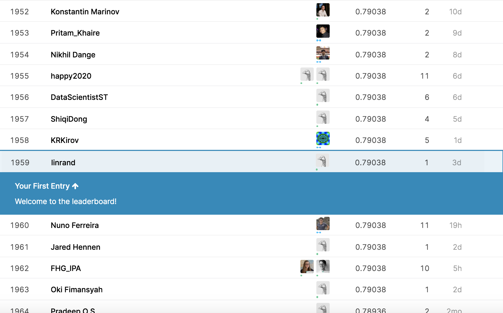

# Real or Not? NLP with Disaster Tweets   
Predict which Tweets are about real disasters and which ones are not
 (Kaggle: https://www.kaggle.com/c/nlp-getting-started/)

### Python Tool Packages


```python
import pandas as pd
import numpy as np
import matplotlib.pyplot as plt
import seaborn as sns
from textblob import TextBlob
import matplotlib.pyplot as plt
import nltk
from nltk.corpus import stopwords
from nltk.tokenize import word_tokenize 
from nltk.stem import PorterStemmer
from textblob import Word 
from sklearn.feature_extraction.text import CountVectorizer
from sklearn.decomposition import TruncatedSVD
from sklearn.preprocessing import StandardScaler
from sklearn.svm import SVC
import xgboost as xgb
from sklearn.feature_extraction.text import TfidfVectorizer
from sklearn import feature_extraction, linear_model, model_selection, preprocessing
from sklearn.linear_model import LogisticRegression
from sklearn.metrics import accuracy_score
from sklearn.naive_bayes import MultinomialNB


```python
train=pd.read_csv("train.csv")
test=pd.read_csv("test.csv")

# Create textblob objects of the tweets
sentiment_objects = [TextBlob(tw) for tw in train['text']]
# Create list of polarity valuesx and tweet text
sentiment_values = [[tweet.sentiment.polarity] for tweet in sentiment_objects]

#Values closer to 1 indicate more positivity, while values closer to -1 indicate more negativity.
sentiment_df = pd.DataFrame(sentiment_values, columns=["polarity"])


```python
def add_polarity(_df):
    _df = pd.concat([_df, sentiment_df], axis=1)
    return _df
train=add_polarity(train)

nltk.download('stopwords')
nltk.download('punkt')
nltk.download('wordnet')

### Data Analysis

```python
# Cleaning & Preprocessing tweets Data
stop_words = set(stopwords.words('english'))
tweet_1=[]
for tw in train["text"]:
    word_tokens = word_tokenize(tw) 
    #Delete ponctuation
    word_tokens=[word.lower() for word in word_tokens if word.isalpha()]
    #Delete stop words
    filtered_sentence = [w for w in word_tokens if not w in stop_words] 
    filtered_sentence = [] 
  
    for w in word_tokens: 
        if w not in stop_words : 
            if  w!='http':
                filtered_sentence.append(w) 

    Stem_words = []
    ps =PorterStemmer()
    for w in filtered_sentence:
        rootWord=ps.stem(w)
        Stem_words.append(rootWord)
    lem=[]
    for w in filtered_sentence:
        word1 = Word(w).lemmatize("n")
        word2 = Word(word1).lemmatize("v")
        word3 = Word(word2).lemmatize("a")
        lem.append(Word(word3).lemmatize())
    tweet_1.append(lem)
```


```python
sentiment_objects = [TextBlob(str(t)) for t in tweet_1]
sentiment_values = [[tweet_1.sentiment.polarity, str(tweet_1)] for tweet_1 in sentiment_objects]
sentiment_values[0]
sentiment_df1 = pd.DataFrame(sentiment_values, columns=["polarity_lem", "lems"])
```


```python
def add_polarity1(_df):
    _df = pd.concat([_df, sentiment_df1["lems"]], axis=1)
    return _df

train=add_polarity1(train)
train["lems"]= train["lems"].str.replace("[", "") 
train["lems"]= train["lems"].str.replace("]", "") 
train["lems"]= train["lems"].str.replace("\'", "") 
train["lems"]= train["lems"].str.replace(",", " ") 
count_vectorizer = CountVectorizer()
X_train = count_vectorizer.fit_transform(train["lems"])
X_test = count_vectorizer.transform(test["lems"])
```


```python
#TfidfVectorizer - Convert text to word frequency vectors.
tfidf_vectorizer = TfidfVectorizer()
X_train_tfidf = tfidf_vectorizer.fit_transform(train["lems"])
X_test_tfidf = tfidf_vectorizer.transform(test["lems"])
```
### Data Preprocessing

```python
sentiment_objects = [TextBlob(str(t)) for t in tweet_2]
sentiment_values = [[tweet_2.sentiment.polarity, str(tweet_2)] for tweet_2 in sentiment_objects]
sentiment_values[0]
sentiment_df1 = pd.DataFrame(sentiment_values, columns=["polarity_lem", "lems"])
```


### generate word vector by using Glove
```python
# Fitting xgboost on Count Vector
xgb_classifier = xgb.XGBClassifier(max_depth=7, n_estimators=200, colsample_bytree=0.8, subsample=0.8, nthread=10, learning_rate=0.1)
scores = model_selection.cross_val_score(xgb_classifier, X_train, train["target"], cv=3, scoring="f1")
xgb_classifier.fit(X_train,  train["target"])

```

### build model

```python
# Fitting xgboost on tfidf
xgb_classifier_tfidf = xgb.XGBClassifier(max_depth=7, n_estimators=200, colsample_bytree=0.8, subsample=0.8, nthread=10, learning_rate=0.1)
scores = model_selection.cross_val_score(xgb_classifier_tfidf , X_train_tfidf, train["target"], cv=3, scoring="f1")
xgb_classifier_tfidf.fit(X_train_tfidf,train["target"])

```
### Training

```python
# Fitting xgboost on Count Vector svd feature
xgb_classifier_svd= xgb.XGBClassifier(max_depth=7, n_estimators=200, colsample_bytree=0.8, subsample=0.8, nthread=10, learning_rate=0.1)
scores = model_selection.cross_val_score(xgb_classifier_svd, xtrain_svd, train["target"], cv=3, scoring="f1")
xgb_classifier_svd.fit(xtrain_svd, train["target"])

# Fitting a simple xgboost on tfidf svd features
xgb_classifier_svd_tfidf = xgb.XGBClassifier(max_depth=7, n_estimators=200, colsample_bytree=0.8, subsample=0.8, nthread=10, learning_rate=0.1)
scores = model_selection.cross_val_score(xgb_classifier_svd_tfidf, xtrain_svd_scl_tfidf, train["target"], cv=3, scoring="f1")
xgb_classifier_svd_tfidf.fit(xtrain_svd_scl_tfidf, train["target"])

```

### Testing

```python
sample_submission = pd.read_csv("sample_submission.csv")
sample_submission["target"]= multinomial_naive_bayes.predict(X_test)
sample_submission.to_csv("submission.csv", index=False)
sample_submission_test = pd.read_csv("test.csv")
sample_submission_test["target"]= multinomial_naive_bayes.predict(X_test)
sample_submission_test.to_csv("submission_test.csv", index=False)
```
## Final Ranking

